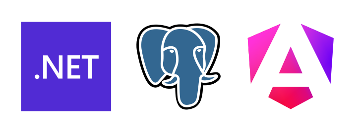

<div align="center">
<h1>Proyecto de Aplicación de SENA - Ficha: ADSO 2721505</h1>

<br>
<br>
</div>

[](https://opensource.org/licenses/MPL-2.0)

Este proyecto forma parte de mi formación en Análisis y Desarrollo de Software en el SENA y tiene como objetivo desarrollar una aplicación utilizando tecnologías modernas para el backend, frontend y bases de datos. A continuación, se describen los detalles del proyecto.

## Descripción del Proyecto

El proyecto incluye la creación de una aplicación con las siguientes tecnologías:

- **Backend**: ASP.Net Core 8.0
- **Frontend**: Angular 17.0
- **Base de Datos**: Postgres DB alojada en un contenedor de Docker
- **Administrador de Base de Datos**: pgAdmin4

## Estructura del Proyecto

La estructura del proyecto se divide en tres partes principales:

1. **Backend**: 
    - Implementado con ASP.Net Core 8.0
    - Proporciona una API RESTful para la comunicación con el frontend
    - Gestiona la lógica de negocio y el acceso a la base de datos

2. **Frontend**:
    - Desarrollado con Angular 17.0
    - Proporciona una interfaz de usuario interactiva y receptiva
    - Consume la API proporcionada por el backend

3. **Base de Datos**:
    - Utiliza Postgres DB
    - Implementada en un contenedor de Docker para facilitar la portabilidad y el despliegue
    - Administrada con pgAdmin4 para la gestión y visualización de datos

## Requisitos Previos

Antes de iniciar con la configuración del proyecto, asegúrate de tener instalados los siguientes componentes:

- Docker y Docker Compose
- Node.js y npm
- .NET Core SDK 8.0
- Angular CLI

## Instalación y Configuración

Sigue los pasos a continuación para configurar el proyecto en tu entorno local:

1. **Clona el repositorio**:

    ```bash
    git clone https://github.com/tu-usuario/proyecto-sena.git
    cd proyecto-sena
    ```

2. **Configura y ejecuta los contenedores Docker**:

    Asegúrate de tener Docker y Docker Compose instalados. Luego, ejecuta:

    ```bash
    docker-compose up -d
    ```

3. **Configura el Backend**:

    Navega al directorio del backend e instala las dependencias necesarias:

    ```bash
    cd backend
    dotnet restore
    dotnet run
    ```

4. **Configura el Frontend**:

    Navega al directorio del frontend e instala las dependencias necesarias:

    ```bash
    cd frontend
    npm install
    ng serve
    ```

## Uso del Proyecto

Una vez que todos los componentes estén en funcionamiento, puedes acceder a la API desde tu navegador web en `http://localhost:5295`. Utiliza pgAdmin4 para administrar la base de datos Postgres en `http://localhost:8080`.

## Contribuciones

Las contribuciones al proyecto son bienvenidas. Por favor, sigue los pasos a continuación para contribuir:

1. Haz un fork del proyecto
2. Crea una nueva rama (`git checkout -b feature/nueva-funcionalidad`)
3. Realiza tus cambios y haz commits (`git commit -am 'Agrega nueva funcionalidad'`)
4. Haz push a la rama (`git push origin feature/nueva-funcionalidad`)
5. Abre un Pull Request

## Licencia

Este proyecto está licenciado bajo la Licencia Pública de Mozilla (MPL) 2.0. Para más información, consulta el archivo [LICENSE](LICENSE).

---

**Autor**: [José Velaides](https://github.com/creativelaides)

**Contacto**: [javelaides@soy.sena.edu.co](mailto:javelaides@soy.sena.edu.co)


